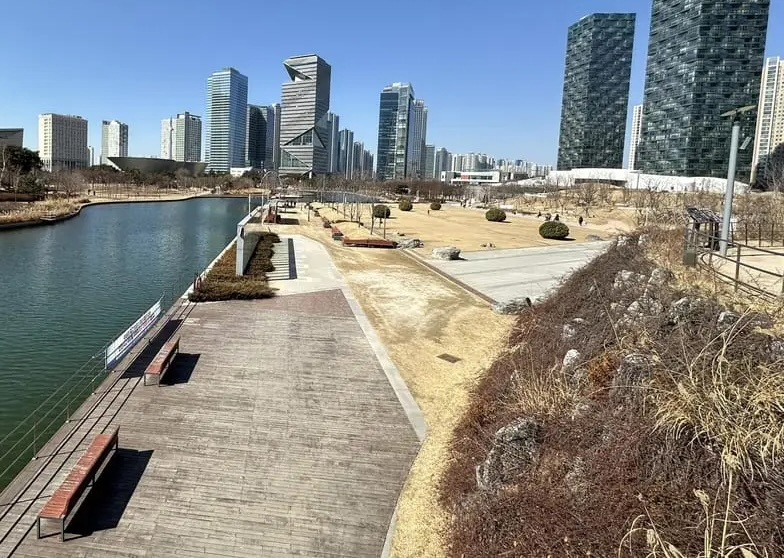
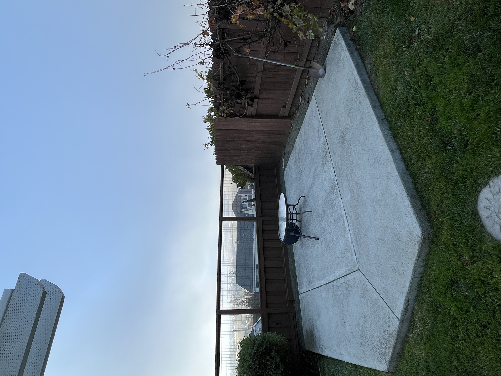
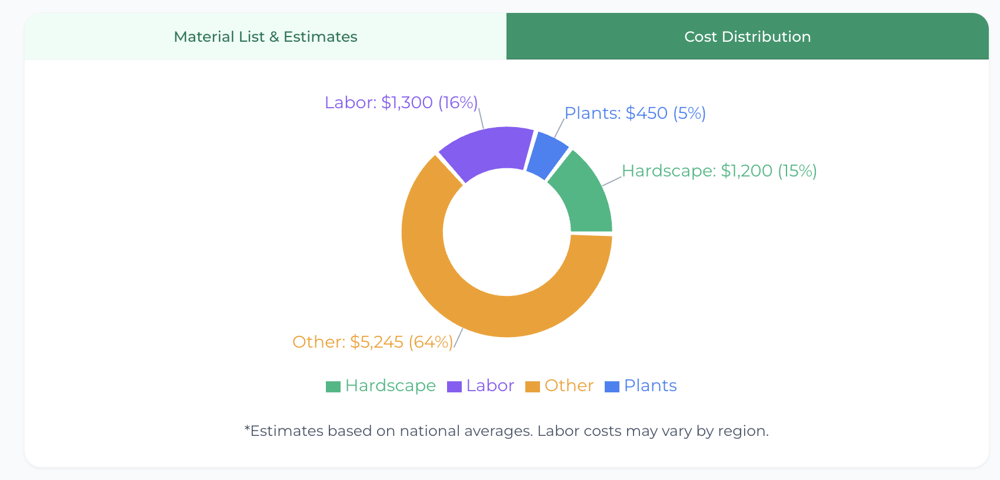

```text
     _         _       ____                       
    / \  _   _| |_ ___/ ___|  ___ __ _ _ __   ___ 
   / _ \| | | | __/ _ \___ \ / __/ _` | '_ \ / _ \
  / ___ \ |_| | || (_) |__) | (_| (_| | |_) |  __/
 /_/   \_\__,_|\__\___/____/ \___\__,_| .__/ \___|
                                      |_|                  
```

> **Reimagine Your Outdoor World with AI**

---

### 🌿 Abstract

**AutoScape** is a next-generation landscape design platform that empowers homeowners and professionals to transform ordinary yards into breathtaking outdoor sanctuaries. By leveraging advanced generative AI and RAG-powered botanical intelligence, AutoScape analyzes your terrain, lighting, and soil conditions to generate photorealistic designs, 2D architectural plans, and precise cost estimates in seconds—bridging the gap between dream and reality.

---

### ✨ Features

*   **AI-Powered Design Engine**: Upload a photo and receive stunning, photorealistic landscape transformations in styles ranging from Modern to Cottage.
*   **Intelligent Analysis**: Automatically detects terrain, existing vegetation, and hardscape elements.
*   **RAG-Enhanced Estimator**: Provides real-time, location-based material lists and cost estimates backed by a retrieval-augmented generation database of plant prices and labor costs.
*   **Cinematic Video Generation**: Creates seamless before-and-after video morphs to visualize the transformation.
*   **Professional Dashboard**: Dedicated tools for designers to manage portfolios, view leads, and showcase their work.
*   **Interactive Results View**: Compare "Before" and "After" states with sliders, view top-down 2D plans, and edit designs on the fly.
*   **Social Sharing**: Share unique, publicly accessible links to your designs with friends or clients.

---

### 📸 Real Transformations

#### The Backyard Makeover

| **Before: The Challenge** | **After: The Vision** |
|:---:|:---:|
|  |  |
| *Original state* | *AI-generated modern oasis* |

#### The Feature Pad

| **Before** | **After** |
|:---:|:---:|
|  |  |
| *Empty space* | *Designed feature area* |

---

### 💰 Intelligent Planning

AutoScape doesn't just design; it plans. Get grounded, real-world estimates.

| **Cost Breakdown** | **Material List** |
|:---:|:---:|
|  |  |
| *Visual budget distribution* | *Itemized material & labor costs* |

---

### 🎥 Cinematic Visualization

Experience the transformation with our AI video generation:

<div align="center">
  <video src="https://firebasestorage.googleapis.com/v0/b/autoscape-dfc00.firebasestorage.app/o/designs%2FOMZtAXa0X1YByXLuzce6rKYP4rC2%2Fvideos%2FxTBZ0Wpd2hHzGzxu9TJs_gemini_1765711470264.mp4?alt=media&token=0806160b-f71f-4233-a983-03e7d88d6e10" width="100%" controls playsinline autoplay loop muted></video>
</div>

> **Note:** If the video above doesn't play in your viewer, [click here to watch locally](https://firebasestorage.googleapis.com/v0/b/autoscape-dfc00.firebasestorage.app/o/designs%2FOMZtAXa0X1YByXLuzce6rKYP4rC2%2Fvideos%2FxTBZ0Wpd2hHzGzxu9TJs_gemini_1765711470264.mp4?alt=media&token=0806160b-f71f-4233-a983-03e7d88d6e10).

---

### 🚀 Getting Started

1.  Clone the repository.
2.  Install dependencies: `npm install`
3.  Run development server: `npm run dev`
4.  Open `http://localhost:5173` to start designing.

---

<div align="center">
  <sub>Built with React, Vite, Firebase, and Gemini AI.</sub>
</div>
