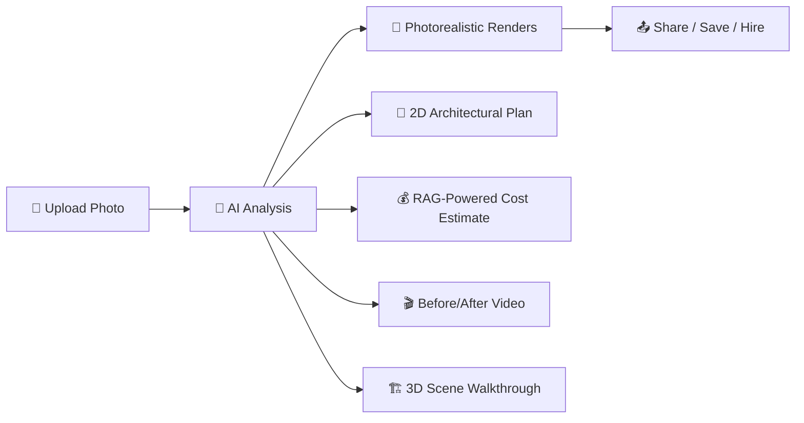
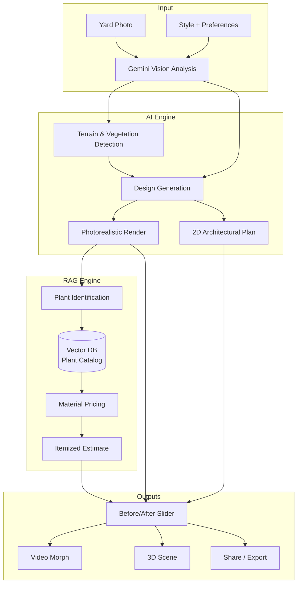
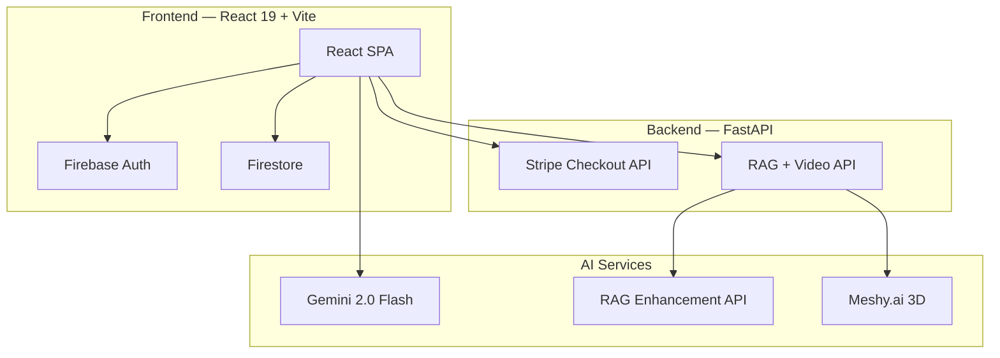

<div align="center">

```text
     _         _       ____                       
    / \  _   _| |_ ___/ ___|  ___ __ _ _ __   ___ 
   / _ \| | | | __/ _ \___ \ / __/ _` | '_ \ / _ \
  / ___ \ |_| | || (_) |__) | (_| (_| | |_) |  __/
 /_/   \_\__,_|\__\___/____/ \___\__,_| .__/ \___|
                                      |_|                  
```

### **AI-Powered Landscape Design for the $189B Outdoor Living Market**

*Upload a photo. Get a photorealistic redesign, 2D plan, 3D walkthrough, and contractor-ready cost estimate — in under 60 seconds.*

[](https://autoscape-dfc00.web.app)
[](https://deepmind.google/technologies/gemini/)
[](https://react.dev)

</div>

---

## 📌 Executive Summary

**AutoScape** is an AI-first platform that transforms how homeowners and professionals design, estimate, and execute landscape projects. We combine generative AI with a retrieval-augmented generation (RAG) engine to convert a single smartphone photo into a complete design package — photorealistic renders, architectural plans, itemized budgets, and 3D walkthroughs — replacing a process that traditionally costs **$2,000–$10,000** and takes **2–6 weeks**.

> **The thesis is simple:** The $189B landscaping industry is fragmented across 693,000 businesses, yet no platform has applied modern AI to collapse the design-to-build workflow. AutoScape does.

---

## 🔥 The Problem

The residential landscaping market is one of the last major home-improvement categories untouched by digital transformation.

| Pain Point | Impact |
|:---|:---|
| **Design is expensive** | Professional landscape architects charge $2K–$10K+ per design — pricing out 80% of homeowners |
| **Timelines are brutal** | 2–6 weeks from consultation to first concept. Revisions add weeks more |
| **Visualization is poor** | Most contractors deliver hand-sketches or flat CAD drawings — homeowners can't see the outcome |
| **Cost blindness** | Homeowners routinely face 30–50% budget overruns because estimates are opaque or nonexistent |
| **Fragmented discovery** | Finding, vetting, and hiring a landscaper is a high-friction, word-of-mouth process |

**The result:** Over **65% of homeowners** who want to improve their landscape never start the project — the upfront cost, complexity, and risk are simply too high.

---

## 💡 The Solution

AutoScape replaces the entire front-end of the landscaping workflow with a single AI-powered experience.



### What makes AutoScape different:

| Capability | Traditional Approach | AutoScape |
|:---|:---|:---|
| **Time to first concept** | 2–6 weeks | **< 60 seconds** |
| **Cost of design** | $2,000–$10,000 | **Free to $29/mo** |
| **Visualization quality** | Flat sketches, basic CAD | **Photorealistic AI renders + 3D** |
| **Budget accuracy** | Verbal estimates, napkin math | **RAG-retrieved, itemized & verified** |
| **Revisions** | Days per round | **Instant — annotate & regenerate** |

---

## 📸 Real Transformations

### The Backyard Makeover

| **Before: The Challenge** | **After: The Vision** |
|:---:|:---:|
|  |  |
| *Unfinished backyard, bare soil* | *AI-generated modern oasis — pavers, plantings, lighting* |

### The Feature Pad

| **Before** | **After** |
|:---:|:---:|
|  |  |
| *Empty concrete slab* | *Designed outdoor living area* |

---

## 📊 Market Opportunity

### TAM / SAM / SOM

```
  ╔═══════════════════════════════════════════════════════════════╗
  ║  TAM — US Landscaping Services          $188.8 BILLION       ║
  ║  ──────────────────────────────────────────────────────────   ║
  ║  ┌─────────────────────────────────────────┐                  ║
  ║  │ SAM — Residential Design & Build  ~$52B │                  ║
  ║  │ ┌───────────────────────┐               │                  ║
  ║  │ │ SOM — Digital-first   │               │                  ║
  ║  │ │ Design Software ~$2.4B│               │                  ║
  ║  │ └───────────────────────┘               │                  ║
  ║  └─────────────────────────────────────────┘                  ║
  ╚═══════════════════════════════════════════════════════════════╝
```

| Metric | Value | Source |
|:---|:---|:---|
| **Total US Landscaping Services** | **$188.8B** (2025) | IBISWorld |
| **5-Year CAGR** | **6.5%** | IBISWorld |
| **Number of US Landscaping Businesses** | **693,000** | IBISWorld |
| **Avg. Homeowner Landscape Spend** | **$3,500–$15,000** per project | Angi / HomeAdvisor |
| **US Homeownership Rate** | **65.6%** (86M households) | US Census Bureau |
| **Home Improvement TAM** | **$620B+** | Harvard JCHS |

### Why Now?

1. **Generative AI inflection** — Gemini, GPT-4V, and diffusion models can now produce photorealistic design output indistinguishable from professional renders
2. **Post-pandemic outdoor investment** — Outdoor living spending surged 30%+ since 2020 and shows no signs of reverting
3. **Millennial homeownership wave** — The largest generation is entering peak home-buying years, and they expect digital-first experiences
4. **Labor shortage** — Landscaping faces a persistent skilled-labor gap, making design automation not just desirable but *necessary*

---

## 🧠 Product Deep Dive

### Core AI Pipeline



### Feature Set

| Feature | Description | Status |
|:---|:---|:---|
| **AI Design Engine** | Gemini-powered photorealistic landscape generation from a single photo | ✅ Live |
| **Multi-Style Library** | Modern, Cottage, Mediterranean, Desert, Japanese, Native, Tropical | ✅ Live |
| **Interactive Edit Mode** | Annotate renders with text notes → AI regenerates specific areas | ✅ Live |
| **Before / After Slider** | Side-by-side comparison with a draggable slider | ✅ Live |
| **RAG Cost Estimator** | Retrieval-augmented pricing with real plant/material database | ✅ Live |
| **2D Architectural Plan** | Auto-generated top-down layout from the design | ✅ Live |
| **Video Generation** | AI-powered cinematic before→after morph (Gemini + Freepik) | ✅ Live |
| **3D Scene Walkthrough** | Image-to-3D via Meshy.ai with orbit controls | ✅ Live |
| **Community Gallery** | Filterable/sortable public design showcase | ✅ Live |
| **Credit System** | Reserve/complete/refund credit lifecycle with Stripe billing | ✅ Live |
| **Designer Dashboard** | Portfolio management, lead tracking, and analytics | ✅ Live |
| **Admin Dashboard** | User management, content moderation, revenue oversight | ✅ Live |

---

## 💰 Business Model

### Credit-Based SaaS with Marketplace Upside

```
┌──────────────┬──────────────┬──────────────┐
│   🆓 Free    │  💎 Pro      │  🏢 Business │
│              │              │              │
│  2 designs   │  Unlimited   │  White-label │
│  Basic AI    │  HD renders  │  API access  │
│  Community   │  3D scenes   │  Team seats  │
│              │  Video gen   │  Priority    │
│              │  Priority    │  Analytics   │
│              │              │              │
│    $0/mo     │   $29/mo     │   Custom     │
└──────────────┴──────────────┴──────────────┘
```

**Revenue Streams:**
1. **Subscription Credits** — Core SaaS revenue from homeowners and designers
2. **Affiliate Commerce** — Revenue share on materials purchased through AutoScape recommendations
3. **Professional Marketplace** — Lead generation fees connecting homeowners with local contractors (planned)
4. **Enterprise API** — White-label design engine for real-estate platforms, home builders, and retail garden centers (planned)

---

## 💰 Intelligent Planning

AutoScape doesn't just design; it plans. Get grounded, real-world estimates.

| **Cost Breakdown** | **Material List** |
|:---:|:---:|
|  |  |
| *Visual budget distribution* | *Itemized material & labor costs* |

---

## 🎥 Cinematic Visualization

Experience the transformation with our AI video generation:

<div align="center">
  <video src="https://firebasestorage.googleapis.com/v0/b/autoscape-dfc00.firebasestorage.app/o/designs%2FOMZtAXa0X1YByXLuzce6rKYP4rC2%2Fvideos%2FxTBZ0Wpd2hHzGzxu9TJs_gemini_1765711470264.mp4?alt=media&token=0806160b-f71f-4233-a983-03e7d88d6e10" width="100%" controls playsinline autoplay loop muted></video>
</div>

> **Note:** If the video above doesn't play in your viewer, [click here to watch](https://firebasestorage.googleapis.com/v0/b/autoscape-dfc00.firebasestorage.app/o/designs%2FOMZtAXa0X1YByXLuzce6rKYP4rC2%2Fvideos%2FxTBZ0Wpd2hHzGzxu9TJs_gemini_1765711470264.mp4?alt=media&token=0806160b-f71f-4233-a983-03e7d88d6e10).

---

## 🏗 Architecture



| Layer | Stack |
|:---|:---|
| **Frontend** | React 19, TypeScript, Vite, Recharts, Three.js |
| **AI Engine** | Google Gemini 2.0 Flash (Vision + Generation) |
| **RAG** | Custom plant catalog + pricing database |
| **3D** | Meshy.ai Image-to-3D API, Three.js viewer |
| **Backend** | FastAPI (Python), Firebase Functions |
| **Database** | Cloud Firestore |
| **Auth** | Firebase Authentication (Google + Email) |
| **Payments** | Stripe Checkout + Customer Portal + Webhooks |
| **Hosting** | Firebase Hosting + Cloud Run |
| **Video** | Gemini Video API + Freepik AI |

---

## 🏆 Competitive Landscape

| | AutoScape | Yardzen | DreamzAR | iScape | HomeOutside |
|:---|:---:|:---:|:---:|:---:|:---:|
| **AI-generated renders** | ✅ | ❌ (human designers) | ⚠️ (AR overlay) | ❌ (manual drag-drop) | ❌ (manual) |
| **< 60 sec design** | ✅ | ❌ (days) | ⚠️ | ❌ | ❌ |
| **RAG cost estimation** | ✅ | ❌ | ❌ | ❌ | ❌ |
| **3D walkthrough** | ✅ | ❌ | ⚠️ (AR only) | ❌ | ❌ |
| **Video visualization** | ✅ | ❌ | ❌ | ❌ | ❌ |
| **Edit & regenerate** | ✅ | ❌ | ❌ | ❌ | ❌ |
| **Price point** | $0–29/mo | $2,499+ | Free (limited) | $24/mo | Free |
| **Target user** | Everyone | Affluent homeowners | Casual | Professionals | Casual |

**Our edge:** AutoScape is the only platform that delivers **end-to-end AI design** — from photorealistic render to itemized budget to 3D walkthrough — at consumer price points, in under a minute.

---

## 🚀 Getting Started

```bash
# Clone
git clone https://github.com/tommypurcell/AutoScape.git && cd AutoScape

# Install
npm install

# Configure environment
cp .env.example .env
# Add your VITE_GEMINI_API_KEY, Firebase config, Stripe keys

# Run frontend
npm run dev

# Run backend (separate terminal)
cd servers && python rag_enhancement_api.py
```

Open **http://localhost:5173** → Upload a yard photo → Get your design.

### Environment Variables Required

| Variable | Purpose |
|:---|:---|
| `VITE_GEMINI_API_KEY` | Google Gemini API key for AI generation |
| `VITE_FIREBASE_*` | Firebase project configuration |
| `VITE_STRIPE_PUBLISHABLE_KEY` | Stripe publishable key |
| `STRIPE_SECRET_KEY` | Stripe secret key (backend) |
| `STRIPE_WEBHOOK_SECRET` | Stripe webhook verification |
| `MESHY_API_KEY` | Meshy.ai key for 3D generation |

---

## 📈 Roadmap

| Quarter | Milestone |
|:---|:---|
| **Q1 2026** | ✅ Core AI engine, RAG cost estimation, 3D scenes, credit system |
| **Q2 2026** | Mobile app (React Native), contractor marketplace MVP, bulk generation API |
| **Q3 2026** | White-label API launch, regional pricing engine, AR on-site preview |
| **Q4 2026** | Enterprise partnerships (home builders, real-estate platforms), Series A fundraise |

---

<div align="center">

**AutoScape** — *Turning every yard into a vision, one photo at a time.*

Built with React, Vite, Firebase, Gemini AI, Three.js, and Stripe.

[Live Demo](https://autoscape-dfc00.web.app) · [Report Bug](https://github.com/tommypurcell/AutoScape/issues) · [Request Feature](https://github.com/tommypurcell/AutoScape/issues)

</div>
